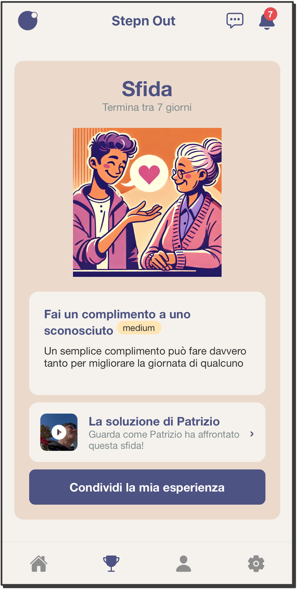
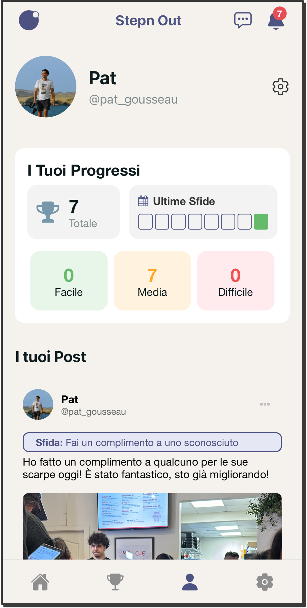
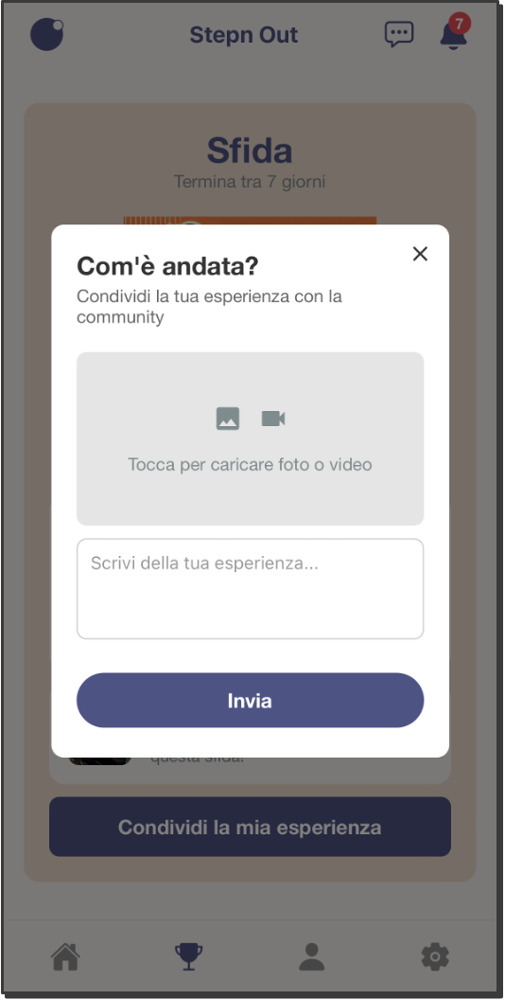

<p align="center">
  
</p>

<h1 align="center">Stepn Out</h1>

<p align="center">
  <strong>One challenge. One week. Step outside your comfort zone.</strong>
</p>

<p align="center">
  <a href="https://apps.apple.com/ca/app/stepn-out/id6739888631">
    
  </a>
  <a href="https://play.google.com/store/apps/details?id=com.patrickgousseau.stepnout&hl=en_CA">
    
  </a>
  <a href="https://www.instagram.com/stepnoutofficial/">
    
  </a>
</p>

<p align="center">
  
  
  
</p>

---

## 📱 About

**Stepn Out** is a mobile app designed to help you break out of your comfort zone—one challenge at a time. Every week, all users receive the same challenge designed to encourage personal growth, build confidence, and foster meaningful connections.

Complete challenges by posting photos, videos, or written reflections to a supportive community feed where users share experiences, motivate each other, and celebrate progress together.

> *"A little discomfort leads to big growth. Ready to Step Out?"*

---

## ✨ Features

- 🎯 **Weekly Challenges** - New challenges every week with varying difficulty levels (Easy, Medium, Hard)
- 📸 **Share Your Journey** - Post photos and videos of your challenge completions
- 💬 **Community Feed** - Two tabs: Challenge Submissions & General Discussion
- 👥 **Supportive Community** - Like, comment, and engage with fellow challengers
- 🔥 **Streak Tracking** - Keep your streak alive and track your progress over time
- 🔔 **Push Notifications** - Stay updated on likes, comments, and new challenges
- 🌍 **Multi-language Support** - Available in English and Italian
- 🔐 **Secure Authentication** - Email/password and Google Sign-In support

---

## 📸 Screenshots

<p align="center">
  
  &nbsp;&nbsp;
  
  &nbsp;&nbsp;
  
</p>

<p align="center">
  
</p>

---

## 🛠️ Tech Stack

| Layer | Technology |
|-------|------------|
| **Framework** | React Native + Expo SDK 52 |
| **Navigation** | Expo Router (file-based routing) |
| **Backend** | Supabase (Auth, Database, Storage) |
| **Language** | TypeScript |
| **State Management** | React Context API |
| **Notifications** | Expo Notifications |

---

## 🚀 Getting Started

### Prerequisites

- Node.js 18+
- npm or yarn
- Expo CLI
- iOS Simulator (Mac) or Android Emulator

### Installation

```bash
# Clone the repository
git clone https://github.com/your-username/StepnOut.git
cd StepnOut

# Install dependencies
npm install

# Start the development server
npx expo start

# Run on iOS
npx expo run:ios

# Run on Android
npx expo run:android
```


## 🌐 Connect With Us

Follow us on social media for updates, challenge previews, and community highlights:

<p align="center">
  <a href="https://www.instagram.com/stepnoutofficial/">
    
  </a>
</p>

---

## 📄 License

This project is licensed under the MIT License - see the [LICENSE](LICENSE) file for details.

---

<p align="center">
  Made with ❤️ by the Stepn Out Team
</p>

<p align="center">
  <strong>Step up. Step out. Step forward.</strong>
</p>

