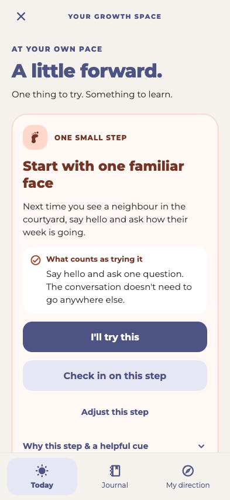
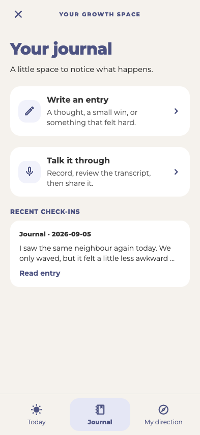
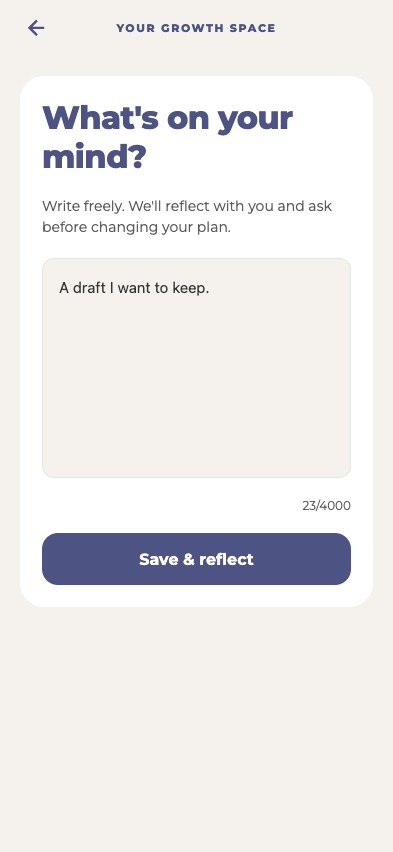
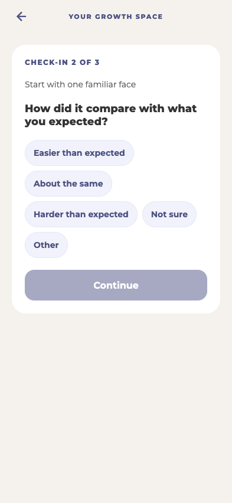
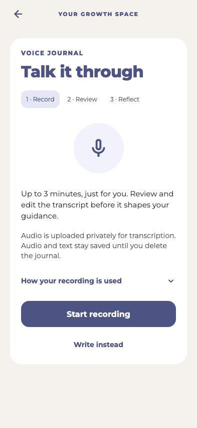
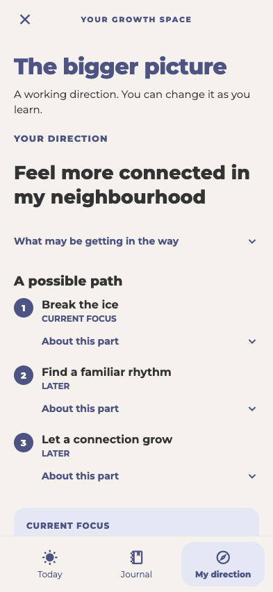

# Guidance UX pass

This is a UI-only layer on top of #289. The guidance, journal, voice, and event service contracts are unchanged; there are no migrations or model changes.

## Experience

- **Today** centers the current step, its action, and what counts as trying. Acceptance and check-in are the main actions; rationale and cues expand on demand.
- **Journal** offers writing and voice as separate destinations, with a compact history and full entry detail. Submitting opens a focused response screen.
- **My direction** holds the goal, working explanation, and milestones, with an explicit way to revisit the direction.
- Check-ins ask about the attempt, then the follow-up, then optional notes. Back preserves answers within the check-in.
- Step adjustments, immediate guidance, events, and pending-change review each have their own focused view. Event rejection reasons appear only after “Not for me.”
- Cross-platform dialogs protect journal and preference drafts. Voice navigation is blocked during recording/processing and warns about unsaved audio/transcript edits before leaving.
- The intake keeps its existing questions, adds back navigation, and folds optional event setup into a disclosure. Confirming opens Today directly.

## Screenshots

These are the real components rendered with React Native Web, bundled offline with synthetic service responses and the app's font/icon assets. They are not native-device screenshots. The mobile journal/voice introduction previews simulate the platform flag; microphone APIs are stubbed and were not exercised. Italian screenshots translate UI chrome; generated fixture content intentionally stays in English.

| Today | Journal | Writing |
| --- | --- | --- |
|  |  |  |

| Check-in | Voice introduction | Direction |
| --- | --- | --- |
|  |  |  |

Additional captures: [event setup](events.png), [event match](event-match.png), [change review](review-change.png), [response](response.png), [empty state](empty.png), [Italian](italian.png), [320px phone](small-phone.png).

## Verification

- `npx eslint src/components/growthGuidance/*.tsx src/constants/translations.ts`
- `npx jest src/utils/__tests__/growthGuidance.test.ts src/utils/__tests__/voiceJournal.test.ts --runInBand` — 11 tests pass.
- `npx expo export --platform ios --platform android --output-dir .local/growth-guidance-verification/ux-final-export` — both native bundles build.
- Offline browser walkthrough covers tab separation, step acceptance, text draft keep/discard, journal submission, check-in stages/back, proposal rejection, preference draft keep/discard, all six event rejection reasons, event acceptance confirmation/cancel, voice introduction/leave guard, empty states, Italian, 320px horizontal overflow, and failed-load recovery. No browser runtime errors.
- Literal translation coverage checked; all static `t()` calls in guidance components have Italian entries.
- Root `npx tsc --noEmit` remains blocked by existing app and Deno configuration/type errors outside this change. Changed feature files have no reported type errors. Removed one duplicate translation key while editing the dictionary.
- Three comprehensive autoreview passes; navigation findings fixed and covered by the browser walkthrough. Ledger remains local at `tmp/autoreview-ledger.md`.

The iPhone simulator boots and has a StepnOut build installed, but an authenticated native walkthrough was not completed. Still verify physical microphone permission/recording/transcription, keyboard and accessibility behavior on iOS/Android, and live backend flows on a test account. No production data, deployments, event-source activation, or beta-readiness work is included.

## Reproduce the offline preview

Install `esbuild` and `playwright` into a temporary directory (not the app's dependencies), then run:

```sh
node tests/growth-guidance-preview/preview.mjs /absolute/path/to/esbuild/lib/main.js
CHROME_PATH='/Applications/Google Chrome.app/Contents/MacOS/Google Chrome' node tests/growth-guidance-preview/check.mjs /absolute/path/to/playwright/index.js
```

The preview listens only on `127.0.0.1:4173`. Optional query flags: `?empty`, `?event`, `?voice`, and `?lang=it`. The check rewrites the screenshots in this directory. It uses synthetic in-memory service responses: it verifies UI interactions, not backend persistence or model quality.
